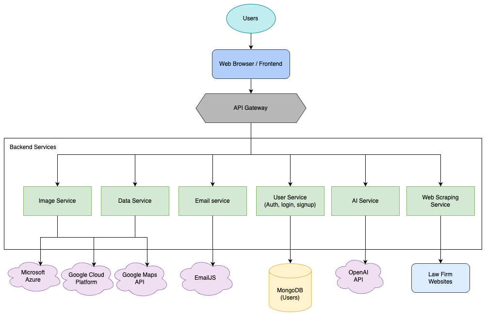
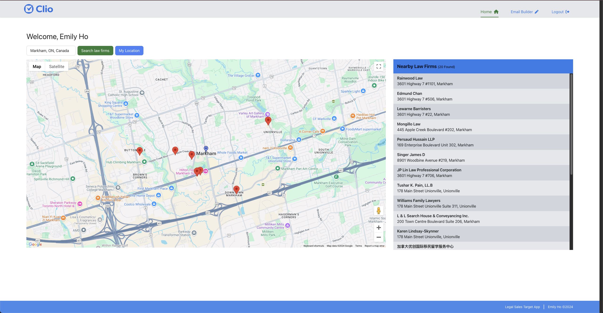
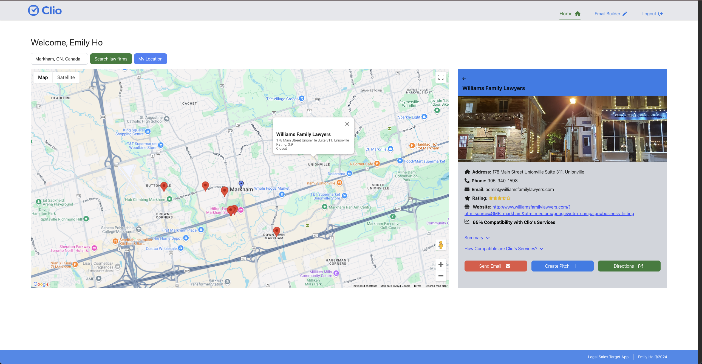
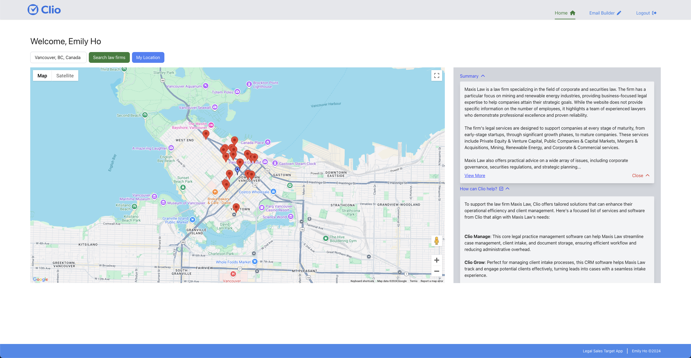
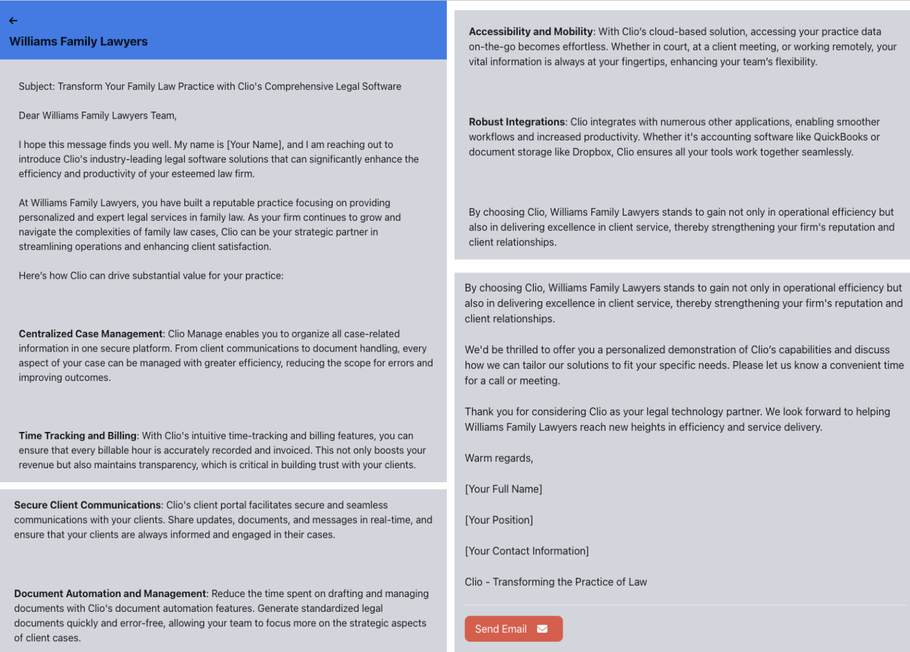
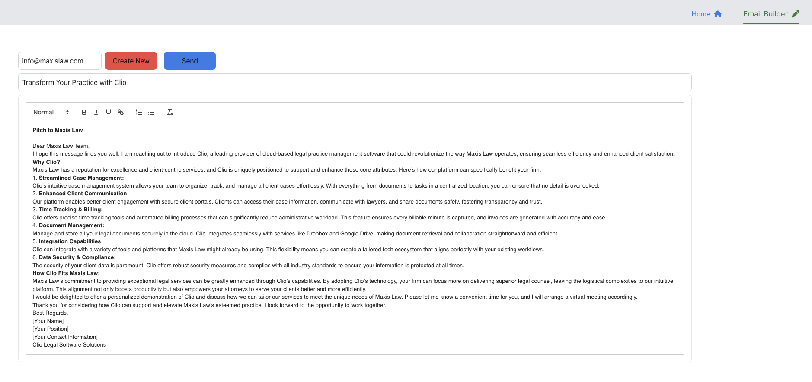
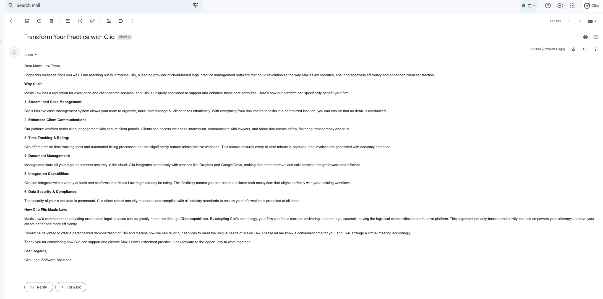
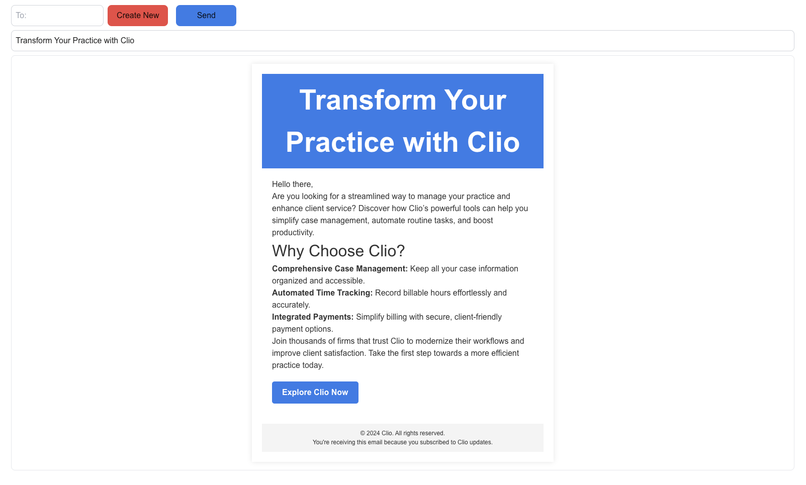
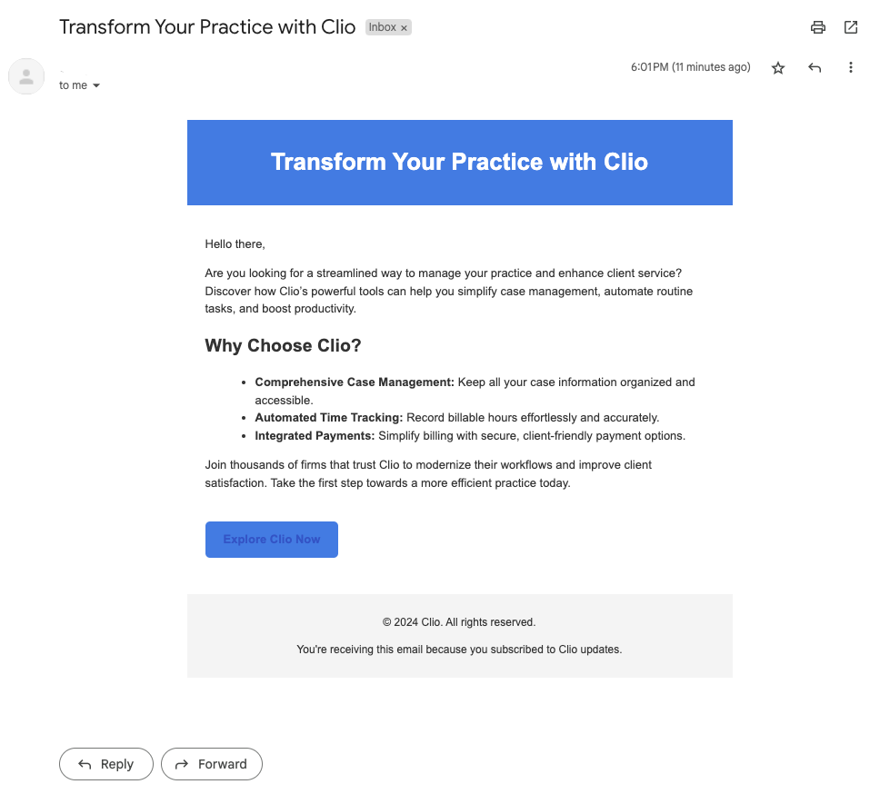

# Legal Sales Target App
This project uses GenAI to find law firms that are the most suitable for Clio's services. It will use that to create personalized pitches and advertisements catered to each firm.

Using a microservice architecture, the web application features an intuitive, map-based interface that allows users to easily explore and target law firms either in their vicinity or within any specific region of interest. Once a firm is selected, the app uses AI to summarize firm websites and give users all the information they need to know about the place. The good thing about this is that it doesn't have to be law firms! This app can be catered towards any business type (ex: doctors, parks, attractions, etc.) and it will always provide users with real-time data.

### The app also goes a step further by:
- Determining how compatible Clio's services are to each law firm.
- Creating customized messages that highlight how Clio’s software and services can support the specific needs of the law firm, considering their practice areas and operational style.
- Developing promotional content and tailored pitches/proposals for each law firm.
- Sending templated or AI-generated emails to the selected law firm to promote Clio or notify them of any updates

## Tech Stack
### Tools, Frameworks, Databases, Languages:
      

### Services:
    

## High-Level Architecture

## How this project was built
- Google Maps API: Integrated for map processing and locating law firms.
- Google Cloud Platform (GCP): Provides law firm data, including main website, address, rating, image, operational hours, and more.
- Web Scraping: Used to retrieve contact information from each law firm's main website (of course ensuring confidentiality if certain sites do not permit this access).
- Microsoft Azure: Used as a secondary source for law firm images if GCP does not have it.
- MongoDB: Stores user data for login, signup, and authentication. The database is hosted on an Microsoft Azure server, and passwords are encrypted.
- OpenAI API to get:
    - Summaries of each law firm (including their practice areas, strengths, potential challenges, and more).
    - The likelihood of the firm becoming Clio's client (in percentage).
    - How Clio's services/software can specifically help/address the law firm's business needs.
    - Personalized pitch for promoting Clio to the law firm.
- EmailJS: Enables sending emails, allowing users to send a pre-made Clio template, a custom message, or an AI-generated pitch to the law firm. Users can also adjust the recipient's email address as needed.
- React: frontend
- Node: backend
- Express: Creates endpoints to connect the frontend to the backend.
- TailwindCSS: Utility-first CSS framework that makes the styling process in React easier.

## Challenges
-  When using OpenAI, I had challenges with token limits and choosing the right AI models to get specific responses. Some AI models do not allow searching the web, so I had to find one that did.
- The email templates and EmailJS uses html, and integrating html with EmailJS and React was one of my challenges. This is because different text being passed in may not be in html. Some were in markdown, so I needed to convert it to html format.
- When web scraping, I need to ensure that I only gather information from sites where scraping is permitted. I must comply with each site's security policies and terms of service.

## Running the app
- Run: `npm start` in the root directory

## Thank you to the following Clions for their valuable insights on Clio's sales teams:
- Scott Adema
- Cole Hecht
- Sahel Hatam
- Molly Ariunbold

## Images

  

    <h3>Login</h3>
    
  

  

    <h3>Signup</h3>
    
  

<h3>Searching for law firms in Markham, ON. (for example)</h3>

<h3>Selecting a law firm</h3>

<h3>AI-generated summary and benefits of Clio's services for the firm</h3>

  

    <h3>AI-generated pitch</h3>
    
  

  

    <h3>Email to send to that law firm using the pitch</h3>
    
  

    <h3>AI-generated pitch sent to the email (to test, I used my email)</h3>
    

  

    <h3>Email template</h3>
    
  

  

    <h3>Email template Sent</h3>
    
    

